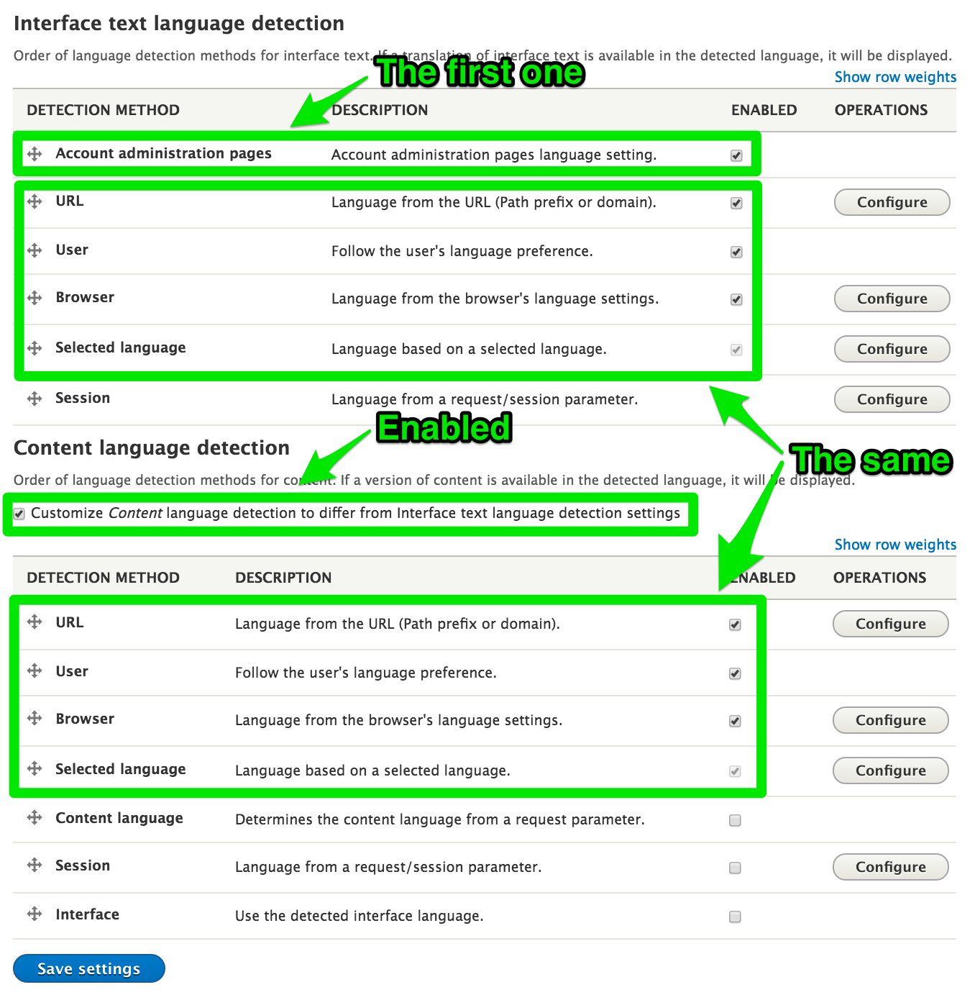

# Admin-language helper

A Drupal 8 module that helps to provide the admin-language feature.

This module does not provide much functionality. You may not need it at all. The main purpose of the module is to provide a tutorial on how to setup the admin-language feature on a multilingual Drupal 8 installation.

## The result

- Admin pages are always shown in the user preferred language
- The content translation behavior is not changed
- It's still possible to create content in different languages, for example
    - /en/node/add/page to create English page
    - /de/node/add/page to create German page

## Supported admin-language configuration

### Patches

First of all, few patches are required to make the following works.

- Fix language detection: https://www.drupal.org/node/2189267
- Add "Content language selected for page" language option: https://www.drupal.org/node/2720251

### /admin/config/regional/language/detection

- Content language is customized
- Interface and content language detection is configured in the same way
- Interface language has "Account administration pages" method in the first place

Example language detection configuration:

Don't forget that users should set "Administration pages language" in their profiles.

### /admin/config/regional/content-language

- The "Default language" of entities is set to "Content language selected for page"

## Features of this module

- It helps Drupal to load field default values in current content language

## TODO || !TODO

- Via a JavaScript dialog, suggest to reload page when language is changed (via the language selector on an entity create page)
- Always keep administration menu in user preferred language
